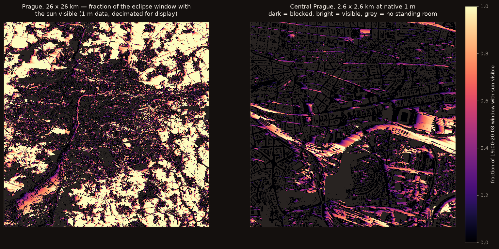

# SunLine

**Where a low sun is actually visible over a city — and where buildings, trees
and terrain block it.**

Built for the partial solar eclipse of **12 August 2026**, which reaches Prague
low in the west-north-west as the sun is setting. At that height geometry stops
being a detail: maximum eclipse here falls with the sun just **1.3°** up, where
a single 20 m apartment block throws a shadow well over a kilometre. Whether you
see it at all comes down to which street you are standing on.

The eclipse is only a time window in `config.yaml`. Point it at any sunrise or
sunset and the pipeline answers the same question for that moment.



---

## What it computes

Two layers, for every square metre, for an observer with their **eyes 1.6 m
above the ground**:

- `visible_fraction.tif` — the fraction of the eclipse window with an
  unobstructed line to the sun. **1.0** means visible throughout, **0.0** never.
- `visible_at_max.tif` — a binary layer at **maximum eclipse**, the single
  moment worth choosing a spot for. Averaging over the window hides it.

Pixels with a roof or closed canopy overhead are masked in both: a building
footprint is not a street that cannot see the eclipse, it is a place you cannot
stand.

### The window is taken from an ephemeris, not typed in

For Prague on 2026-08-12 (JPL DE421, `make eclipse`):

| | |
|---|---|
| first contact | 19:19:30, sun 9.35° |
| **maximum** | **20:11:45, sun 1.33°** — magnitude 0.885, obscuration 0.862 |
| sunset | 20:20:30 |
| last contact | 21:01:45, sun −5.85° — below the horizon, never seen |

The window therefore runs **first contact → sunset**. It is worth stating why
this is checked in code: an earlier hand-entered window started at 19:00 and
stopped at 20:08, so it counted twenty minutes of ordinary sunshine as
"eclipse" and discarded maximum entirely. `make sun` now cross-checks the
configured window against the ephemeris and complains if it misses first
contact or maximum.

Resolution is 1 m, from Czech national lidar. Sun positions are **apparent**
(refraction-corrected): at 5° elevation the atmosphere lifts the disc by ~0.17°,
which at this sun height is the difference between a street being lit or not.

---

## Three findings worth knowing before you read the code

### The lidar does not have to be downloaded as text

The obvious route to ČÚZK's DMP 1G is the Atom feeds: zipped XYZ point files,
one per 2.5 × 2 km map sheet. For a Prague-sized box that is **~2,000 sheets and
roughly 300 GB** of text — days of downloading, and more than fits on many
laptops.

ČÚZK also publishes the same models as ArcGIS ImageServer services:

| service | model | native | type |
|---|---|---|---|
| [`3D/dmp`](https://ags.cuzk.gov.cz/arcgis/rest/services/3D/dmp/ImageServer) | surface, incl. buildings & vegetation | 0.5 m | Float32 |
| [`3D/dmr5g`](https://ags.cuzk.gov.cz/arcgis/rest/services/3D/dmr5g/ImageServer) | bare earth terrain | 2 m | Float32 |

Both accept `exportImage`, returning a Float32 GeoTIFF already in EPSG:5514 for
any bounding box. The same area becomes **64 requests and 3.7 GB, in about six
minutes.** That is what `sunline fetch` does.

### Eye height goes on the terrain, not on the surface

It is tempting to compute visibility as `DSM + 1.6 m`. That puts the observer
standing *on top of* the tree canopy and the rooftops, and cheerfully reports a
clear view of the sun for someone who is in fact underneath a lime tree.

The observer stands on **DMR 5G** (bare earth); the blockers are **DMP**
(surface). `tests/test_shadow.py::test_observer_stands_on_terrain_not_canopy`
pins the difference.

A building footprint is also not a street that cannot see the eclipse — it is a
place you cannot stand. Where the surface sits more than 2 m above the terrain,
something is directly overhead and the pixel is **masked out** rather than
scored zero. Without that, about a third of the city reads as blocked street
when it is simply indoors.

### The distant horizon should come from the same model, downsampled

The obvious source for terrain 10–100 km out is a global DEM — Copernicus
GLO-30 is free and covers everything. It is the wrong choice here, for a reason
that only shows up when measured.

The ČÚZK ImageServer will return **any** bounding box at **any** resolution, so
the far field can be the *same* DMP, requested progressively coarser with
distance. Over a ridge 60 km WNW of Prague:

| | peak elevation |
|---|---|
| Copernicus GLO-30 | 444.8 m |
| ČÚZK DMP, crest-preserved | **450.9 m** |

GLO-30 sits **6.1 m low**, because averaging shaves ridge crests — and a shaved
ridge lets the sun through where it should not.

The same trap applies to the downsampling itself. The ImageServer resamples by
**averaging** (verified: a 50 m request matches a local mean-pool to within
0.14 m), which costs a mean of 3.1 m of crest, p95 13 m, worst **36 m**. So each
ring is requested *finer* than it is marched and **max-pooled locally**, keeping
the crest instead of the mean.

Sizing follows an angular error budget of 0.02°, far below both the 0.5° solar
disc and the ~0.7° the sun drops between timestamps. A crest error `h` at
distance `d` costs `atan(h/d)`, so precision is spent near and saved far:

| ring | requested | max-pooled to | crest budget |
|---|---|---|---|
| 3–15 km | 5 m | 15 m | 1.0 m |
| 15–40 km | 10 m | 30 m | 2.6 m |
| 40–100 km | 25 m | 75 m | 7.0 m |

Net effect: the far horizon comes out at **3.35°** against GLO-30's 3.24°, and
blocks 3.6% of the AOI at the low end rather than 3.1%. Everything also stays in
one vertical datum (Bpv), so no ray ever compares heights across datasets.

---

## The algorithm

Rotate the raster so the direction *toward* the sun runs along −x. Every pixel
in a row then shares one sight-line, and `s` — distance along the row —
increases away from the sun. A blocker at `s_j < s_i` occludes a point at `s_i`
when

```
z_j  >  z_i + (s_i − s_j)·tan e
z_j + s_j·tan e  >  z_i + s_i·tan e
```

Substituting `g = z + s·tan e` collapses that to `max_{j<i} g_j > g_i` — a plain
running maximum. **One pass per row, O(N) for the whole raster, no per-pixel ray
casting.**

The sweep does not return a boolean. It returns

```
M = (exclusive running max of g) − s·tan e
```

the **minimum eye elevation, in metres above sea level, needed to see the sun at
that pixel**. `M` is a physical height, so it is independent of the rotated
frame: rotate the surface in, rotate `M` back out, compare against the observer
in the original grid. Only one array is ever rotated, and the intermediate is
directly meaningful — *"your window would need to be N metres higher."*

Rotation uses **nearest-neighbour** resampling. Bilinear would round off roof
edges and systematically shorten every shadow; here that is a correctness
requirement, not a speed choice.

### Validation against the real sky

The strongest check was not synthetic: four sunset photographs taken near
Neratovice on 11 Aug 2026 (19:53–20:20), compared out-of-sample against the
model's predicted horizon for that spot and those minutes. **Three of four
match exactly**; the fourth disagrees where the real sun's extended disc showed
through a ~10 m gap that the model — which treats the sun as a point — scored
as blocked. The error is in the pessimistic direction, and smaller than the
solar disc width the model already documents ignoring.

### Tests

Every case in `tests/test_shadow.py` has a closed-form answer, which is what
catches the two errors a real DSM would hide — a shadow cast *toward* the sun,
and a shadow of the wrong length.

```
make test
```

Covered: shadow direction for all four cardinal azimuths; length equal to
`h/tan e` at four elevations; linear decay of `M` with distance; the
self-shadowing threshold of a uniform ramp; and the terrain-vs-canopy case above.

---

## Scope and honest limits

**Regions.** Two 26 × 26 km boxes so far, tiling edge-to-edge: Prague
(`config.yaml`) and the country north to Mělník (`configs/north.yaml`) —
Kralupy, Neratovice, and the Vltava–Labe confluence. Each region builds its own
PMTiles archive, which keeps every file under GitHub's 100 MB limit; the map
loads them all. Adding a region is a new config plus
`make demo CFG=configs/<region>.yaml`.

**The sun-elevation floor is 1°**, set by how far the 1 m near field reaches:

| sun elevation | reach of a 40 m block | |
|---|---|---|
| 2.0° | 1146 m | inside the halo |
| 1.0° | 2292 m | inside the halo |
| 0.76° | 3015 m | past it — coarse rings would answer for local buildings |

It was 2° when the halo was 1200 m, and that floor cut the series four minutes
before maximum eclipse (apparent ~1.7°) — the one moment the map exists to
describe. Widening the halo is what made 1° honest.

Timestamps below the floor are dropped from the composite **denominator** too,
so a genuinely open site can still score 1.0.

Caveats that remain below ~1.5°: refraction varies with air temperature by more
than 0.1°; the solar disc is 0.53° across, so "visible" really means "disc
centre visible"; and extinction leaves the sun a dim red sliver that haze often
hides outright.

**What each model covers, and how far**

Nothing is mosaicked together — the models stay separate and meet inside the
sweep, per 4 km block, per timestamp:

```
observer_z = DMR + 1.6 m
covered    = (DMP − DMR) > 2.0 m       → masked out
M          = sweep(DMP)                 ← blockers only
seen       = observer_z > M             ← DMP × DMR meet here
seen      &= sun_elevation > horizon    ← far-field rings enter last
```

- **Fine sweep, 1 m, to 3 km.** Each block reads its own ±3000 m halo, sweeps,
  then crops the halo off. The halo bounds any pixel's sight-line, and it caps
  blocker height at `tan(1°) × 3000 = 52 m`.
- **Coarse sweep, 5 m, to 13 km — the tall-structure pass.** Prague is full of
  things taller than 52 m: the Žižkov tower (216 m) shadows **12.4 km** at a 1°
  sun, the Pankrác towers 6+ km, church spires 3.4–5.7 km. Their tails were
  being cut off at the fine halo — visible on the map as shadows that simply
  stop, and first noticed against the real horizon, not in the code. The same
  cummax sweep re-runs on a max-pooled DSM with a 13 km halo and is ANDed in.
  Costs: shadow edges gain ~5 m of fuzz (0.09 m of eye height at 1°), and
  flat earth over 13 km over-blocks by up to 0.05° — pessimistic, never
  optimistic.
- **The far-field rings run 13–100 km**, along one azimuth per timestamp,
  solved on a 1 km grid and interpolated to pixels, curvature-aware.
- **Each tier hands off exactly where the next begins** — 3 km and 13 km —
  and `tests/test_coverage.py` asserts all of it, including that the coarse
  halo clears a 220 m structure at the elevation floor.

The buffer was originally 1200 m, sized to "how far a 40 m building reaches at
the 2° floor". That was the wrong question, and it left a **1.2–3 km band that
neither model covered**. Measured, that band contributes up to **9.5°** of
horizon (p95 3.4°) and left **12% of locations wrong for at least one
timestamp** — several times the far field's own effect. Nothing errored; the map
just looked plausible and was quietly optimistic. The buffer is now sized to
meet the rings instead, and a test enforces it.

**Known gaps:**

- **Rays that leave Czechia get an open horizon.** ČÚZK stops at the border;
  the affected fraction is reported at build time. For Prague the whole 100 km
  WNW ray stays inside Czechia, so this is currently nil.
- **Data vintage — measured, not assumed.** The original plan repeated the
  DMP 1G documentation: "lidar 2009–2013". Checked empirically, that is wrong
  for this service: the DSM contains **V Tower** (topped out 2018) as its two
  distinctive lobes, and the 270 m long **Masaryčka** block (topped out 2022).
  So `3D/dmp` serves ČÚZK's *new* national laser scan and includes construction
  through **at least 2022**. Anything newer may still be missing, and tree
  heights drift with growth — both stated on the map itself.
- **The sun is treated as a point.** The real disc is ~0.5° wide, so a roofline
  cutting it in half reads here as fully visible.
- **`3D/dmp` is published for 3D visualisation.** It has not been checked
  against the authoritative DMP 1G sheet products tile for tile.

---

## Running it

```bash
make venv          # .venv + dependencies
make test          # analytic shadow + eclipse + coverage tests
make eclipse       # contact times from JPL DE421
make sun           # solar geometry, cross-checked against the ephemeris
make demo          # fetch -> composite -> publish, end to end
make publish-max   # the binary at-maximum-eclipse layer as its own archive
make serve         # http://localhost:8000
make demo CFG=configs/north.yaml   # any other region
```

The map has a layer toggle: **Whole window** (the fraction ramp) and **At
maximum** (visible or blocked at 20:12 exactly). The at-max archives are
optional — the toggle disables itself with a hint if they have not been built.

`make fetch` caches per tile and resumes, so re-running is cheap.

Tune `--block-m` on `composite` if memory is tight: the AOI is swept in blocks
so peak usage stays near 400 MB per worker rather than the ~5 GB a whole-grid
rotation would need.

## Deploying

`web/` is entirely static — HTML, JS, and one PMTiles archive read over HTTP
range requests. GitHub Pages supports those (verified: `206 Partial Content`),
so no tile server, backend or database is involved.

`.github/workflows/pages.yml` publishes `web/` and fails loudly if the archive
is missing or breaches GitHub's 100 MB per-file limit.

**Zoom is capped at z15 (~3 m/px), not z16.** `publish` builds the deepest zoom
first, measures, and steps back one level if the archive would breach the size
budget — which it does here: z16 came out at 174.7 MB against z15's 54.7 MB.
The underlying analysis is still 1 m; only the served tiles are coarser. To
recover z16, either split the AOI into several archives or host off-repo, where
the 100 MB limit does not apply.

Note that `make serve` uses `web/serve.py`, not `python -m http.server` — the
stdlib server answers every request with `200` and the whole body, and PMTiles
is built on range requests, so the map appears to hang on a file that loads
instantly in production.

## Attribution

Elevation data: **Podkladová data © ČÚZK, CC BY 4.0**. This attribution is
required wherever the map is displayed and is built into the page footer.
Basemap © OpenStreetMap contributors © CARTO.

## Licence

MIT (code). The data keeps its own licence.
